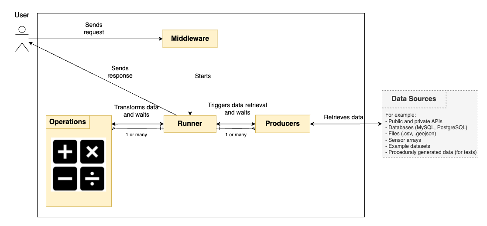

# Tools4Cities Middleware


[](https://overbrowsing.com/projects/co2-shield)

Tools4Cities Middleware allows users to fetch, transform, and process data from various sources using Producers and Operations.

## What is it?

The purpose of the Tools4Cities Middleware is to enable users to perform operations on data from different sources via the use of the following abstractions:

- Producer: connects to data sources and fetches data
- Operation: describes transformations to be performed on producer outputs (data)
- Runner: calls a series of producers, executes a series of operations on the producer's outputs, and then outputs the resulting data



You can see a more detailed breakdown of resposibilities for the Middleware, Producers and Operations [here](./docs/architecture.png).

## What do I need?

- Java 21
- Eclipse 2024-06 (4.32.0)
- Maven version 3.7.x (embedded in Eclipse)
- Postman (optional)

## How do I set it up?

- Open the terminal and check Java installation by typing "java --version". If Java is set up correctly, you should see the Java version printed on the terminal.
- Open Eclipse. On the left-side menu, select Import > Maven > Existing Maven Projects.
- Select project directory: tools4cities-middleware.
- Click "Finish" and wait for the project to load.
- After loading, right-click the "middleware" folder, and select Maven > Update Project.
- Right-click again and select: Run As > maven install
- Right-click again and select: Run As > maven test

Alternatively, if you have mvn set up in the command line, you can also run:

```bash
mvn dependency:purge-local-repository -DactTransitively=false -DreResolve=false
mvn clean
mvn validate
mvn install
```

## How do I use it?

- This middleware is a REST API which receives queries as input and generates data as output.
- A query is a JSON file where you specify which data you want, and which transformations you wish to apply to the data. You can see query examples in the folder /docs/examples.
- You can call the middleware routes using either Postman or via code using your favourite programming language. For example, you can use the requests package in [Python](https://www.geeksforgeeks.org/get-post-requests-using-python/) or the fetch API in [JavaScript](https://developer.mozilla.org/en-US/docs/Web/API/Fetch_API/Using_Fetch).
- If you are familiar with Postman, you can also find a Postman collection in the folder /docs/examples.

The following routes are available:

| **Method** | **API Route URL**       | **Description**                                                                              | **Input**                        |
|------------|-------------------------|----------------------------------------------------------------------------------------------|----------------------------------|
| GET        | /producers/list         | Lists all Producers and their parameters                                                     |                                  |
| GET        | /operations/list        | Lists all Operations and their parameters                                                    |                                  |
| POST       | /apply/sync             | Executes query synchronously (will not return until completed)                               | A JSON query in the request body |
| POST       | /apply/async            | Executes query asynchronously (will return a runner ID instantly)                            | A JSON query in the request body |
| GET        | /apply/async/{runnerId} | Returns status of a runner ID. If the runner is completed, returns the prime Producer result | A runner ID                      |
| GET        | /apply/ping             | Returns pong (this is great to test if the middleware is running 😊)                          |                                  |
| POST       | /exists                 | Returns a list of prime Producers which match the given query                                | A JSON query in the request body |

For now, the amount of Producers, Operations and parameters is quite limited, but we intend to expand it in the future and also document it better. Your suggestions are more than welcome!

## Who do I talk to?

Project manager: gabriel.cavalheiroullmann at concordia.ca

## Development Guidelines

- If you wish to integrate your changes into the middleware, please create a new branch from develop, make your changes, and then open a PR requesting merge into develop.
- The branch develop is the working branch for developers. We will merge develop into master from time to time when we reckon to have a stable version or major new features.
- Tests shall be written to show the proper way Producers and Operations should be used. Consequently, the tests will also ensure these classes are working as intended by the developer.
