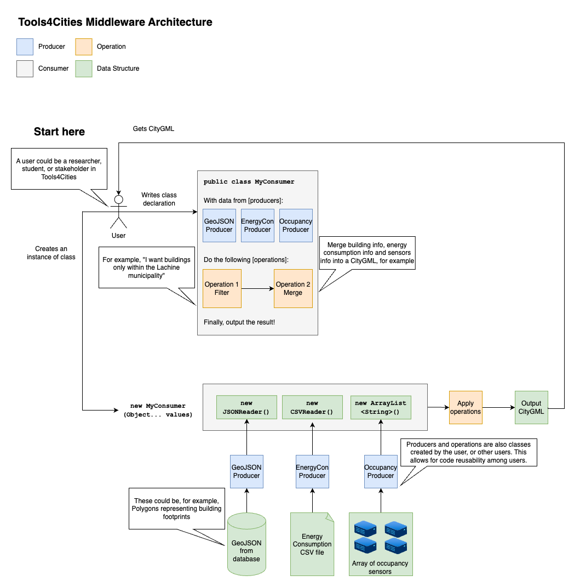

# Tools4Cities Middleware


Tools4Cities Middleware allows users to fetch, transform, and process data from various sources using Producers, Operations, and Consumers.

## What is it?

The purpose of the Tools4Cities Middleware is to enable users to perform operations on data from different sources via the use of the following abstractions:

- Producer: connects to data sources and fetches data
- Operation: describes transformations to be performed on producer outputs (data)
- Consumer: calls a series of producers, executes a series of operations on the producer's outputs, and then outputs the resulting data



## What do I need?

- Java 17
- Eclipse 2024-06 (4.32.0)
- Maven version 3.7.x (embedded in Eclipse)

## How do I set it up?

- Open the terminal and check Java installation by typing "java --version". If Java is set up correctly, you should see the Java version printed on the terminal.
- Open Eclipse. On the left-side menu, select Import > Maven > Existing Maven Projects.
- Select project directory: tools4cities-middleware.
- Click "Finish" and wait for the project to load.
- After loading, right-click the "middleware" folder, and select Maven > Update Project.
- Right-click again and select: Run As > maven install
- Right-click again and select: Run As > maven test

Alternatively, if you have mvn set up in the command line, you can also run:

```bash
mvn dependency:purge-local-repository -DactTransitively=false -DreResolve=false
mvn clean
mvn validate
mvn install
```

## Who do I talk to?

Project manager: gabriel.cavalheiroullmann at concordia.ca

## Guidelines

- Tests shall be written to show the proper way producers, consumers and operations should be used.
- Consequently, the tests will also ensure these classes are working as intended by the developer.
- In the future, a code review process will be implemented to ensure changes will be integrated correctly, and that proper coding standards are followed.
